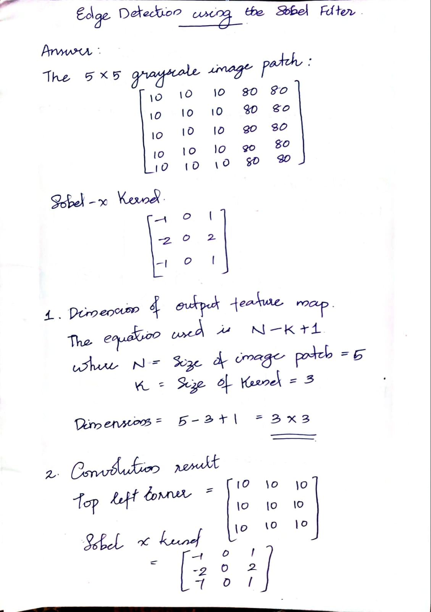
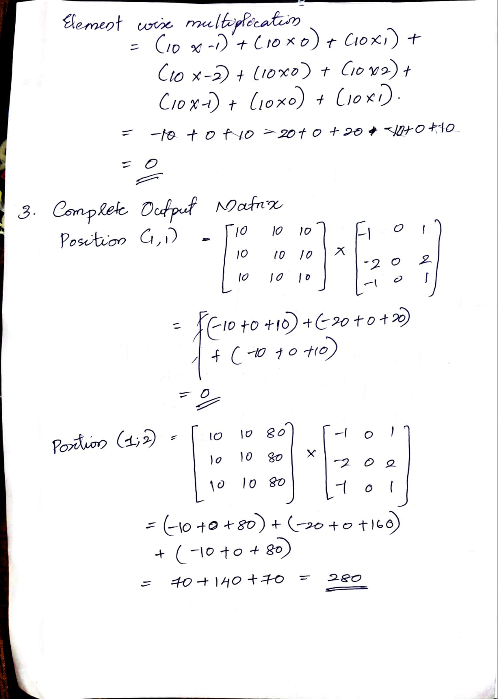
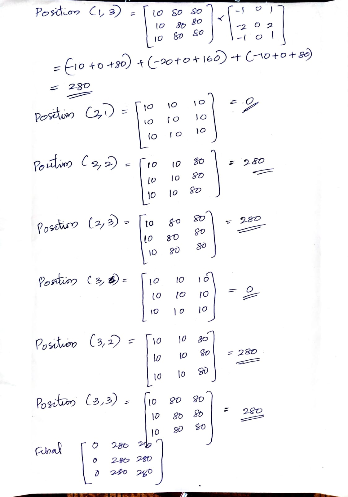
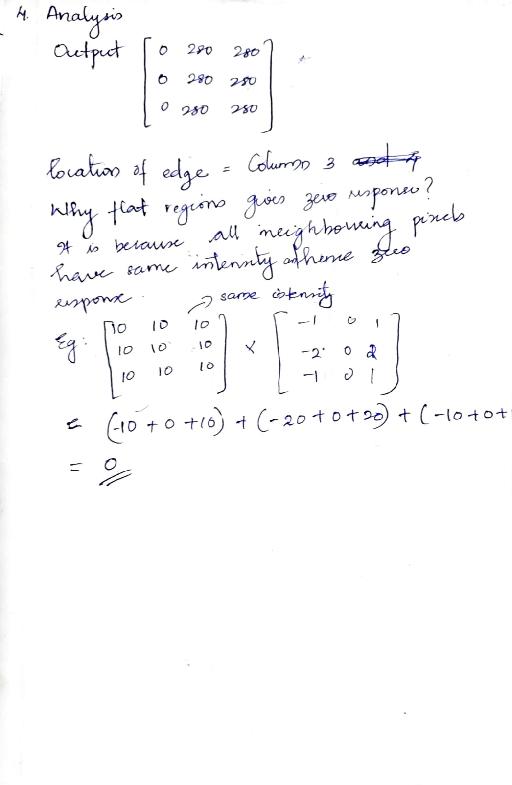
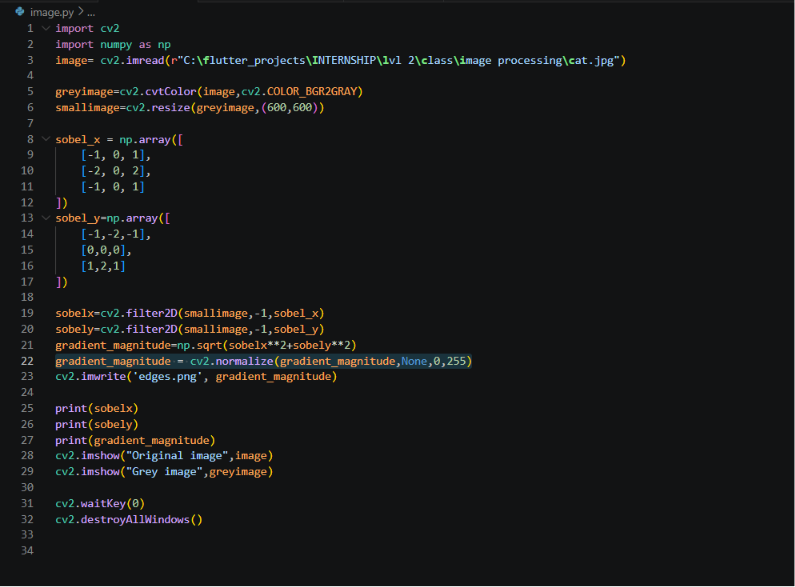
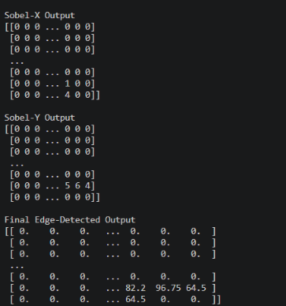
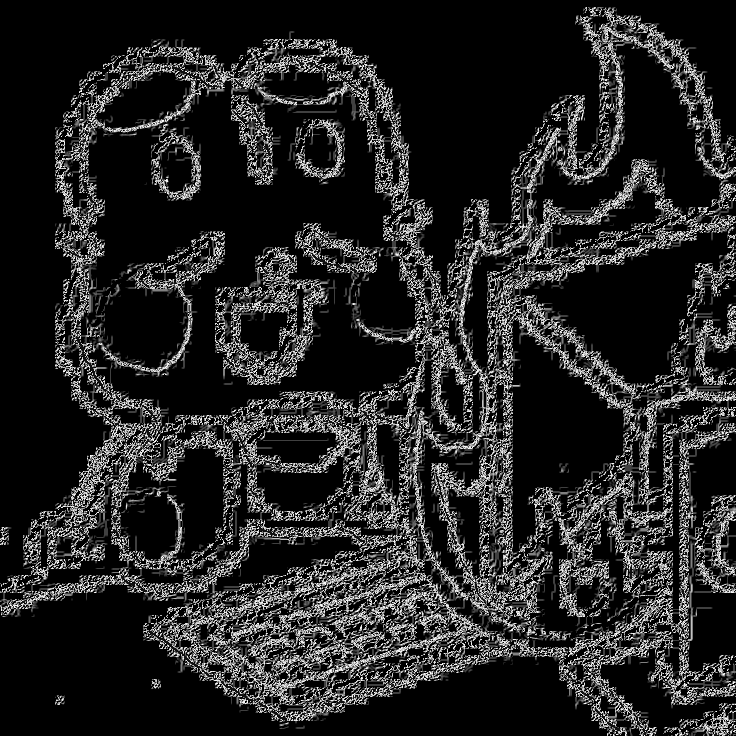

# image-processing-opencv
Image processing using open cv by Mithra Nandhana BA

## Problem Statement
Spatial Filtering and Edge Detection using the Sobel Operator

## Answer
*check out the whole pdf:* `image-processing-opencv/numericals/calculation.pdf/`

And, implementation of the same is done using python. The code is saved in the `image-processing-opencv/imageprocessing.py/`.

The code and the output along with results are given below.

## *Code*

## *Output*

## *OriginalImage*

## *GreyscaleImage*

## *EdgeImage*

## Final Answer
Sobel-X Output
[[0 0 0 ... 0 0 0]
 [0 0 0 ... 0 0 0]
 [0 0 0 ... 0 0 0]
 ...
 [0 0 0 ... 0 0 0]
 [0 0 0 ... 1 0 0]
 [0 0 0 ... 4 0 0]]

Sobel-Y Output
[[0 0 0 ... 0 0 0]
 [0 0 0 ... 0 0 0]
 [0 0 0 ... 0 0 0]
 ...
 [0 0 0 ... 0 0 0]
 [0 0 0 ... 5 6 4]
 [0 0 0 ... 0 0 0]]

Final Edge-Detected Output
[[ 0.    0.    0.   ...  0.    0.    0.  ]
 [ 0.    0.    0.   ...  0.    0.    0.  ]
 [ 0.    0.    0.   ...  0.    0.    0.  ]
 ...
 [ 0.    0.    0.   ...  0.    0.    0.  ]
 [ 0.    0.    0.   ... 82.2  96.75 64.5 ]
 [ 0.    0.    0.   ... 64.5   0.    0.  ]]

# What I Learned
By this assignment and class, I learned:
1. Image Processing using cv2
:D
